<div align="center">

# Navly

**A dual-kernel store copilot architecture for WeCom / OpenClaw, built around a data middle platform and a permission/session-binding kernel.**

<p>
  <a href="docs/specs/navly-v1/2026-04-06-navly-v1-design.md">
    
  </a>
  <a href="docs/architecture/navly-v1/2026-04-06-navly-v1-architecture.md">
    
  </a>
  <a href="platforms/auth-kernel/README.md">
    
  </a>
  <a href="docs/README.md">
    
  </a>
</p>

</div>

> [!IMPORTANT]
> Navly 当前处于 **`baseline-for-implementation` / active bootstrap** 阶段。
> 这个仓库的目标不是延续旧问答胶水，而是先建立两个长期内核：
> 1. **数据中台内核**：数据真相、可答真相、回放、审计、projection / serving
> 2. **权限与会话绑定内核**：actor / role / scope / conversation、Gate 0、治理审计
>
> 上层 runtime 与 host bridge 目前保持 **thin shell / controlled adapter** 形态，优先保证结构正确，而不是一次性堆满功能。

## What is Navly?

Navly 是一个正在重建中的门店 Copilot 系统，但它的架构重心不是 prompt glue，也不是旧业务问答链路，而是两个可长期沉淀的系统内核：

- **Data Platform Kernel**
  - 负责原始数据保真、canonical facts、latest usable state、completeness / readiness、projection / serving、审计与回放
- **Permission & Session-Binding Kernel**
  - 负责 actor identity、role / scope binding、conversation binding、Gate 0 access control、治理与访问审计
- **Thin Runtime Shell**
  - 只负责 capability routing、answer composition、fallback / escalation，默认不持有数据真相和权限真相
- **OpenClaw Host Bridge**
  - 作为 WeCom / OpenClaw 的受控宿主适配层，把宿主上下文安全地交给内核与 runtime

Navly 当前的第一输入域是 **Qinqin**，第一接入域是 **WeCom + OpenClaw**。

## Architectural stance

Navly 的核心判断是：

- 它不是旧业务问答系统的延长线
- 它不是“先做一个聪明 Agent，再慢慢补数据”的系统
- 它应该先把 **数据中台** 和 **权限 / 会话绑定内核** 做成长期资产
- 上层执行壳必须 **薄、稳、可替换**
- `upstreams/openclaw/` 是 **可参考、可裁剪、可受控集成** 的 upstream source，不是 Navly 产品逻辑的随手实现目录

换句话说：**先做强内核，再做薄上层。**

## Architecture at a glance


<p align="center">
  
</p>

### Layer responsibilities

| Layer | Owns | Must not own |
| --- | --- | --- |
| Data Platform | raw source preservation, canonical facts, latest usable state, completeness, projections, replay, audits | actor access truth, conversation routing policy |
| Permission Kernel | actor, role, scope, conversation, Gate 0, access decision, governance trail | business facts, serving objects, metric semantics |
| Runtime Shell | interaction orchestration, capability routing, answer composition, fallback / escalation | data truth, final access truth |
| Host Bridge | host ingress, controlled handoff, host-local diagnostics | shared canonical truth, business capability logic |

完整结构与图示请看：

- [`docs/specs/navly-v1/2026-04-06-navly-v1-design.md`](docs/specs/navly-v1/2026-04-06-navly-v1-design.md)
- [`docs/architecture/navly-v1/2026-04-06-navly-v1-architecture.md`](docs/architecture/navly-v1/2026-04-06-navly-v1-architecture.md)
- [`docs/architecture/navly-v1/diagrams/navly-v1-target-blueprint.svg`](docs/architecture/navly-v1/diagrams/navly-v1-target-blueprint.svg)

## Repository map

| Path | Responsibility | Current status |
| --- | --- | --- |
| [`shared/contracts/`](shared/contracts/README.md) | 跨模块公共契约、JSON Schema、主枚举冻结 | phase-1 schema seed / canonical contract baseline |
| [`platforms/data-platform/`](platforms/data-platform/README.md) | 数据中台内核：ingestion、raw-store、warehouse、sync-state、completeness、serving | bootstrap skeleton + fixture-backed member insight vertical slice backbone |
| [`platforms/auth-kernel/`](platforms/auth-kernel/README.md) | 权限与会话绑定内核：actor resolution、binding、Gate 0、access context | milestone B backbone |
| [`bridges/openclaw-host-bridge/`](bridges/openclaw-host-bridge/README.md) | OpenClaw / WeCom 宿主适配、runtime handoff、host diagnostics | milestone B host handoff backbone |
| [`runtimes/navly-runtime/`](runtimes/navly-runtime/README.md) | thin runtime shell：interaction、routing、execution、answering、outcome | milestone B guarded execution backbone |
| [`docs/`](docs/README.md) | purpose-first 文档体系：specs / architecture / api / audits / runbooks / reference | baseline aligned |
| [`upstreams/`](upstreams/README.md) | upstream 源码快照与受控参考区 | active archive |

## Why this repo may look unusual

和很多“先写应用、后补架构”的仓库不同，Navly 当前有几个非常明确的取向：

1. **Docs-first**：文档先行，目录与模块边界先冻结，再逐步推进实现
2. **Contracts-first**：跨模块对象先用 shared contracts 固定语言，再做模块实现
3. **Kernel-first**：先闭合 data platform / auth kernel 主链路，再做 richer runtime
4. **Auditability-first**：重视 raw replay、historical run truth、latest usable state、readiness explanation
5. **Controlled upstream reuse**：参考 upstream，但不把上游目录直接当成产品实现层

## Quick start

### Prerequisites

当前仓库已有验证脚本主要依赖：

- `bash`
- `python3`
- `node`
- `rg` (ripgrep)

### Validate the current repository baseline

```bash
bash platforms/auth-kernel/scripts/validate-milestone-b.sh
bash runtimes/navly-runtime/scripts/validate-milestone-b.sh
bash bridges/openclaw-host-bridge/scripts/validate-milestone-b.sh
python3 -m unittest discover -s platforms/data-platform/tests -p 'test_*.py'
```

### First usable alpha smoke baseline

当前 first usable alpha 的 smoke baseline 见：

- `docs/specs/navly-v1/verification/2026-04-09-navly-v1-first-usable-alpha-smoke-and-status-board.md`
- `scripts/validate-first-usable-alpha-smoke.sh`

当前推荐直接运行：

```bash
bash scripts/validate-first-usable-alpha-smoke.sh
```

### Run the current data-platform sample slice

下面这个示例会用 fixture transport 跑一个 Qinqin member insight 垂直切片，并把产物写到临时目录：

> 该示例使用仓库内 fixture transport，不需要 live 凭证，也不应在 README 中填写真实门店标识或真实密钥。

```bash
OUTPUT_DIR="$(mktemp -d)"
python3 platforms/data-platform/scripts/run_member_insight_vertical_slice.py \
  --org-id <sample-org-id> \
  --start-time '2026-03-20 09:00:00' \
  --end-time '2026-03-24 09:00:00' \
  --requested-business-date 2026-03-23 \
  --app-secret <sample-app-secret> \
  --output-dir "$OUTPUT_DIR"
```

当前 fixture-backed sample 会写出下面这棵 artifact tree；这反映的是当前 milestone B backbone，而不是 phase-1 最终 serving 形态：

```text
$OUTPUT_DIR/
  canonical/
    consume_bill.json
    consume_bill_info.json
    consume_bill_payment.json
    customer.json
    customer_card.json
  historical-run-truth/
    endpoint-runs.json
    ingestion-runs.json
  latest-state/
    latest-usable-endpoint-state.json
    vertical-slice-backbone-state.json
  raw-replay/
    raw-response-pages.json
```

当前 sample 还**不会**产出 `projections/` 或 `serving/`；这两个边界仍然属于目标架构，但不是当前 sample runner 的实际输出。

## Documentation map

Navly 的文档按 **用途优先** 组织，而不是按业务目录堆放。推荐从下面这些入口开始：

| Goal | Read |
| --- | --- |
| 先理解 Navly_v1 的整体目标与边界 | [`docs/specs/navly-v1/2026-04-06-navly-v1-design.md`](docs/specs/navly-v1/2026-04-06-navly-v1-design.md) |
| 先理解结构分层与图示 | [`docs/architecture/navly-v1/2026-04-06-navly-v1-architecture.md`](docs/architecture/navly-v1/2026-04-06-navly-v1-architecture.md) |
| 先理解公共语言与 canonical IDs | [`docs/specs/navly-v1/2026-04-06-navly-v1-shared-contracts-layer.md`](docs/specs/navly-v1/2026-04-06-navly-v1-shared-contracts-layer.md) / [`docs/reference/navly-v1/2026-04-06-navly-v1-canonical-ids-and-glossary.md`](docs/reference/navly-v1/2026-04-06-navly-v1-canonical-ids-and-glossary.md) |
| 深入数据中台 | [`docs/specs/navly-v1/data-platform/README.md`](docs/specs/navly-v1/data-platform/README.md) / [`platforms/data-platform/README.md`](platforms/data-platform/README.md) |
| 深入权限与会话绑定内核 | [`docs/specs/navly-v1/auth-kernel/README.md`](docs/specs/navly-v1/auth-kernel/README.md) / [`platforms/auth-kernel/README.md`](platforms/auth-kernel/README.md) |
| 深入 runtime shell | [`docs/specs/navly-v1/runtime/README.md`](docs/specs/navly-v1/runtime/README.md) / [`runtimes/navly-runtime/README.md`](runtimes/navly-runtime/README.md) |
| 深入 OpenClaw host bridge | [`docs/specs/navly-v1/openclaw-host-bridge/README.md`](docs/specs/navly-v1/openclaw-host-bridge/README.md) / [`bridges/openclaw-host-bridge/README.md`](bridges/openclaw-host-bridge/README.md) |
| 查看外部输入真相源 | [`docs/api/qinqin/README.md`](docs/api/qinqin/README.md) |
| 了解 upstream 采用方式 | [`docs/specs/navly-v1/2026-04-06-navly-v1-upstream-integration-policy.md`](docs/specs/navly-v1/2026-04-06-navly-v1-upstream-integration-policy.md) / [`upstreams/README.md`](upstreams/README.md) |
| 查看全局文档索引 | [`docs/README.md`](docs/README.md) |

## Current implementation focus

当前仓库的重点不是“把所有上层能力都做完”，而是先闭合这些链路：

1. **Qinqin API docs → connector / ingestion → raw replay → canonical facts**
2. **historical execution truth ↔ latest usable state ↔ completeness / readiness**
3. **projection / serving outputs → runtime consumption**
4. **host evidence → actor resolution → role / scope / conversation binding → Gate 0 → access context**
5. **bridge / runtime / kernel / data-platform 之间的 shared contract 对齐**
6. **bridge -> runtime handoff 顶层 `decision_ref` 统一等于 `access_context_envelope.decision_ref`；`gate0_decision_ref` 只保留在 bridge local metadata / delivery hints**

## Contribution notes

如果你要继续推进这个仓库，建议遵循以下原则：

- 优先保证 **系统边界正确**，而不是追求最小 diff
- 不要混淆 **raw truth / latest state / completeness truth / projection truth**
- 不要把 tenant、store、route、permission、secret 写死在产品逻辑里
- 改动架构边界时，**代码与文档一起更新**
- 把 `upstreams/` 当成参考与受控复用区，而不是产品业务逻辑落地目录

面向 AI / agentic 工作流的仓库级约束见：[`AGENTS.md`](AGENTS.md)

## Project direction

Navly 的长期目标是成为一个：

- **globally coherent** 的门店数据与执行系统
- **structurally correct** 的双内核架构仓库
- 对未来上层 Copilot / orchestration / prediction 层 **可持续复用** 的底座
- 对审计、回放、解释、补数与治理 **易于推理与验证** 的系统

如果你只想记住一句话：

> **Navly is not being rebuilt around prompt glue. It is being rebuilt around data truth and access truth.**
